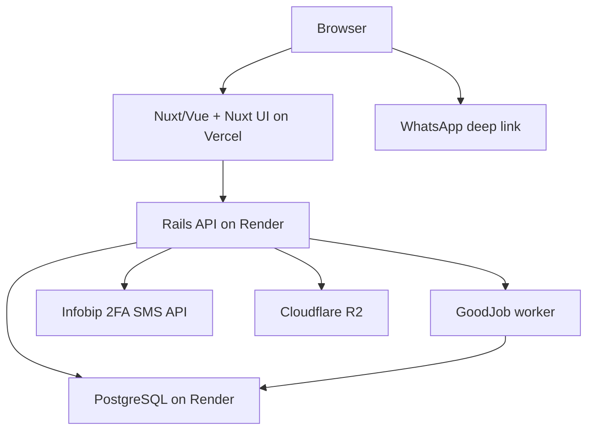

# Berufe — Lean MVP Infrastructure and Architecture

**Status:** implementation baseline
**Updated:** August 13, 2026
**Companions:** _Berufe — MVP Feature Plan_, _Berufe — MVP Implementation Stories_, and _Berufe — V2 Stories_

## 1. Purpose and scope

This document defines only the technical decisions needed to build and operate the Berufe MVP for approximately 30–50 professionals in Joinville.

The MVP is a responsive web application where professionals maintain profiles and simple quotes, admins manually review trust evidence, customers search public profiles without an account, and conversations and quote sharing continue through WhatsApp.

The architecture must protect private identity evidence and support reliable releases without introducing infrastructure that the launch does not need.

## 2. Architecture decision

Use two applications and one database:



- **Frontend:** Nuxt using Vue, TypeScript, and Nuxt UI. Nuxt server-renders public profile and Finder pages for fast loading, share previews, and search-engine visibility; Nuxt UI supplies the reusable interface components.
- **Backend:** Ruby on Rails in API-only mode. Rails owns business rules, authorization, application sessions, data access, file authorization, moderation actions, and background jobs through Active Job.
- **Database:** one managed PostgreSQL database accessed only by Rails through Active Record.

This is still a modular monolith. The frontend and API are separate deployables, but the backend remains one application—not a collection of services.

Frontend and backend live in one monorepo. Local development and integration tests start the complete application stack through one root `compose.yaml`.

## 3. MVP stack

| Concern          | Decision                                                                       | Purpose                                                                                                                            |
| ---------------- | ------------------------------------------------------------------------------ | ---------------------------------------------------------------------------------------------------------------------------------- |
| Frontend         | Nuxt + Vue + TypeScript                                                        | Public SSR pages and authenticated dashboard in one Vue application.                                                               |
| Frontend UI      | Nuxt UI (`@nuxt/ui`)                                                           | Accessible Vue components and Tailwind-based theming without building a separate design system.                                    |
| Frontend hosting | Vercel                                                                         | Nuxt deployments, CDN, previews, and environment variables.                                                                        |
| Backend          | Rails API-only                                                                 | REST JSON API, business logic, authorization, and integrations.                                                                    |
| Backend hosting  | Render web service                                                             | Managed Rails runtime close to the database.                                                                                       |
| Worker hosting   | Render background worker                                                       | Runs GoodJob from the same backend image as Rails.                                                                                 |
| Database         | Render PostgreSQL                                                              | The single source of truth for accounts and product data.                                                                          |
| ORM/migrations   | Active Record                                                                  | Rails-native models, constraints, transactions, and migrations.                                                                    |
| Background jobs  | GoodJob                                                                        | PostgreSQL-backed Active Job processing without Redis or a separate queue service.                                                 |
| Local runtime    | Docker Compose                                                                 | Starts Nuxt, Rails, GoodJob worker, and PostgreSQL consistently from the monorepo.                                                 |
| Authentication   | Infobip 2FA SMS API + Rails-owned accounts/sessions + Rails-managed admin TOTP | Infobip sends/verifies SMS codes; Rails owns identity, browser sessions, revocation, authorization, and the separate admin factor. |
| File storage     | Cloudflare R2 through a small Rails storage adapter                            | S3-compatible public/private object storage using feature-owned media records.                                                     |
| Source and CI    | GitHub + GitHub Actions                                                        | Pull requests and automated checks.                                                                                                |
| API contract     | OpenAPI 3.1 in `apps/contracts/openapi.yaml`                                   | Language-independent source of truth for the Rails/Nuxt HTTP boundary.                                                             |
| Error tracking   | Bugsnag                                                                        | Error-only reporting for Rails, GoodJob, Nuxt browser code, and Nuxt SSR.                                                          |
| Code quality     | Standard Ruby, Nuxt ESLint, Prettier, Brakeman                                 | Backend/frontend linting, formatting, and backend security scanning.                                                               |
| Tests            | RSpec, Vitest, and Playwright                                                  | Backend rules, frontend behavior, and critical complete flows.                                                                     |

Use supported stable releases of Ruby, Rails, Node, Nuxt, and PostgreSQL. Pin Ruby/Node versions and dependency lockfiles in the repository.

## 4. Third-party services

### Required now

| Service       | Berufe uses it for                           | Data shared                                                                                                   | If unavailable                                                                                                |
| ------------- | -------------------------------------------- | ------------------------------------------------------------------------------------------------------------- | ------------------------------------------------------------------------------------------------------------- |
| Vercel        | Nuxt hosting and preview deployments         | Web requests and technical logs                                                                               | The website may be unavailable; API/data remain intact.                                                       |
| Render        | Rails web/worker hosting and PostgreSQL      | API requests, application data, jobs, and technical logs                                                      | The API or background work may pause; frontend shows retry/pending states.                                    |
| Infobip       | Professional phone OTP only                  | Phone number, 2FA application/message-template context, challenge ID, delivery state, and verification result | New challenges and verification pause; existing Rails sessions continue until their own expiry or revocation. |
| Cloudflare R2 | Portfolio and verification files             | Uploaded files and metadata                                                                                   | Upload/view actions pause; database records remain intact.                                                    |
| GitHub        | Source and CI                                | Source code and test/build output                                                                             | Development/deployment pause; production continues.                                                           |
| WhatsApp      | User-initiated contact and sharing           | Prefilled text only after the user taps                                                                       | Offer copy-number or copy-link fallback.                                                                      |
| Bugsnag       | Application exception reporting and alerting | Redacted exception diagnostics, release, environment, route/job class, and request ID                         | Platform logs and health checks remain available; operators investigate manually.                             |

### Not required now

- No identity backend-as-a-service; Infobip is a narrowly scoped SMS OTP integration.
- No WhatsApp messaging API.
- GoodJob is the only queue implementation. It uses the existing PostgreSQL database, so no Redis, Sidekiq, or external queue service is required.
- No CAPTCHA/bot-challenge service at launch.
- No external search engine.
- No payment, email, maps/geocoding, CMS, or PDF-generation provider.
- No third-party analytics platform; keep only the small aggregate events needed to evaluate the MVP.

## 5. Responsibilities and request flow

### Public page

1. Nuxt renders the public route on the server.
2. Nuxt requests approved public data from the Rails API.
3. Rails queries indexed PostgreSQL data and returns JSON.
4. Nuxt produces the page and its title/share metadata.

Launch with fresh SSR and no Redis or separate cache for 30–50 profiles. Before launch, measure the complete Vercel-to-Render path from the target Brazilian region. If the latency budgets in §15 fail, block launch until a separate change adds a 60-second Nuxt/CDN stale-while-revalidate cache with explicit invalidation for approval, hiding, restoration, and suspension. Private dashboard, admin, restricted-file, and token-authorized quote responses must never use a shared cache.

### Shared quote page

1. The professional explicitly shares a high-entropy quote bearer link through WhatsApp or copies it.
2. Nuxt resolves the token through the typed Rails API and never places the raw token in application logs, analytics, or error reports.
3. Rails hashes the supplied token, returns only the matching shared quote plus approved public professional identity, and returns the same generic not-found response for malformed, unknown, or revoked tokens.
4. Rails and Nuxt return `Cache-Control: private, no-store`; Nuxt adds `noindex`, `nofollow`, and `Referrer-Policy: no-referrer`. The route is rendered at request time and excluded from static generation and shared caches.
5. The customer may view or use browser print. The bearer token grants no mutation, acceptance, signature, invoice, or payment authority.

### Authenticated change

1. Vue sends a JSON request with the session cookie and CSRF header.
2. Rails authenticates the session.
3. Rails checks the role, record ownership, and current workflow state.
4. Rails validates the request and applies the change in a database transaction.
5. Rails returns a stable JSON response; Vue displays the result.

### API contract

- OpenAPI 3.1.0 in `apps/contracts/openapi.yaml` is the source of truth for the HTTP boundary. Prefix every product endpoint with `/api/v1`; health and worker probes may remain outside that namespace.
- Use JSON request and response bodies. Document cookie authentication and the required CSRF header in the contract.
- Return one stable error envelope containing `code`, a safe `message`, `field_errors` as a map of field names to arrays of safe messages when applicable, and `request_id` as a string.
- Use pagination and deterministic ordering for lists.
- Keep private/internal fields out of serializers by default.
- Allow credentialed CORS only from exact local, stable-staging, and production Nuxt origins. Never use a Vercel preview wildcard.
- Generate `apps/web/app/services/api/schema.d.ts` from the contract with `openapi-typescript`. Keep `client.ts` and `errors.ts` handwritten; use `openapi-fetch` as the small typed transport rather than creating a workspace package.
- Validate Rails request and response behavior against the same OpenAPI document with `openapi_first`. Contract coverage must identify undocumented operations or important response statuses.
- An API-changing feature is incomplete until the contract, generated TypeScript, Rails contract tests, and frontend consumer change together.
- Do not create GraphQL or a public developer API for the MVP.

## 6. Backend organization

Use a Rails monolith organized by product capability:

```text
app/
  controllers/api/v1/
  models/
  policies/
  serializers/
  services/
    accounts/
    catalogs/
    profiles/
    portfolio/
    verification/
    network/
    finder/
    quotes/
    reports/
    moderation/
  validators/
config/
db/
  migrate/
spec/
```

Minimum rules:

- Controllers authenticate, authorize, validate request shape, and delegate; they do not contain the workflow.
- Active Record models hold associations, constraints, and small record-level invariants.
- Multi-step workflows live in named service objects grouped by capability.
- Authorization policies are explicit and tested.
- Serializers define exactly what leaves the API.
- External services are called through small purpose-specific adapters such as `InfobipOtpClient` and `R2Storage`; do not build a generic provider framework.
- Use database transactions for state changes that touch multiple records.
- Avoid callbacks for important business workflows; invoke those changes explicitly.
- Configure GoodJob as the Active Job adapter and run it in `external` mode through the dedicated worker. Start with one `default` queue for image sanitization/processing, expired counter/token/file/session cleanup, aggregate maintenance, and nonurgent provider reconciliation. Interactive OTP initiation never enters GoodJob. Jobs must be safe to retry; add more queues only after measured contention.
- Start the API with `RAILS_MAX_THREADS=5` and `DB_POOL=5`. Start the worker with `GOOD_JOB_MAX_THREADS=2` and `DB_POOL=5`; this covers two execution threads and GoodJob's utility connections without increasing the pool prematurely.
- Size the connection budget as `(API replicas × API pool) + (worker replicas × worker pool) + migration/admin allowance`. For one API replica and one worker replica, reserve 15 connections—five for Rails, five for GoodJob, and five for migrations/administration—and choose a managed plan with at least 20 available connections. Recalculate before adding replicas or threads.

## 7. Frontend organization

```text
app/
  components/
  composables/
  layouts/
  middleware/
  pages/
  services/api/
  types/
  utils/
tests/
  e2e/
```

Minimum rules:

- Pages compose features; reusable visual pieces live in components.
- Use Nuxt UI components first for forms, buttons, navigation, overlays, tables, and feedback states.
- Configure Berufe colors, typography, spacing, and component defaults centrally. Use Tailwind utilities only for page layout and small adjustments.
- Create custom components for Berufe-specific combinations, not wrappers around every Nuxt UI component.
- Do not add another component library, a separate design-system package, or Storybook for the MVP.
- API calls go through one typed API client, not directly from scattered components.
- Nuxt route middleware improves navigation but never replaces Rails authorization.
- Use Nuxt SSR for public Finder/profile pages; authenticated dashboard pages may fetch after hydration. Token-authorized quote pages are request-time only and must never enter static generation or a shared cache.
- Use component-local state or Nuxt `useState` first. Add Pinia only when genuinely shared client state becomes difficult to manage.
- Do not duplicate backend business rules. The frontend may provide instant feedback, but Rails revalidates every change.

## 7.1 Monorepo and local runtime

Use this minimum root layout:

```text
/
  apps/
    api/
    web/
    contracts/
      openapi.yaml
  compose.yaml
  .env.example
  README.md
  docs/
```

The Compose stack contains only four services:

| Service  | Responsibility                                                          |
| -------- | ----------------------------------------------------------------------- |
| `web`    | Nuxt development server with source mounted from `apps/web/`.           |
| `api`    | Rails API server with source mounted from `apps/api/`.                  |
| `worker` | `bundle exec good_job start` process built from the same backend image. |
| `db`     | PostgreSQL with a named development volume and health check.            |

One command starts the project: `docker compose up --build`. The API and worker share the same image and environment definition. Use health checks so Rails and the worker wait for PostgreSQL readiness; do not rely only on container start order. Keep all four services if source-mounted Nuxt and Rails hot reload remain comfortable on the team's development machines.

The four-service source-mounted setup was validated on 2026-08-15 on macOS 26 arm64: Nuxt's watcher and Rails development reloader both observe host edits without rebuilding either image, with no material delay during ordinary development.

Keep Dockerfiles inside `apps/web/` and `apps/api/`, but keep orchestration at the repository root. There is one Node application, so use pnpm without a workspace and keep generated API types inside the frontend. Commit `.env.example` with names and safe defaults only; never commit real credentials.

Local development uses a local-disk storage adapter and a fake SMS-OTP adapter by default. R2 and live Infobip calls are opt-in integration checks, not requirements for starting the stack. Do not add Redis, MinIO, a mail catcher, or other support containers until an implemented feature needs them.

Docker Compose standardizes local development and CI integration runs; it is not the MVP production orchestrator. Production keeps the Nuxt and Rails deployments separate on Vercel and Render.

## 8. Authentication and authorization

### Professional login

Use Infobip's 2FA API for the narrow purpose of starting and verifying Brazilian SMS OTP challenges. Before production onboarding, complete the required Brazilian sender registration/Letter of Authorization process, provision a dedicated 2FA application and message template, record cost/delivery limits, and approve the privacy/data-processing terms. Keep the integration behind a purpose-specific `InfobipOtpClient` so tests and non-production environments can use a fake without turning authentication into a generic provider framework.

1. The user enters a Brazilian phone number.
2. Rails normalizes the number to E.164 and checks the OTP cooldown and daily allowance.
3. Rails synchronously asks Infobip to start the challenge; Infobip sends the SMS code and returns the challenge reference needed for verification. Rails binds that encrypted reference and the encrypted normalized phone to a short-lived high-entropy browser token stored only as a digest.
4. The user submits that Rails challenge token and the code; Rails validates the unexpired/unconsumed record, asks Infobip to verify the bound challenge, and validates the result.
5. If approved, Rails creates or finds the Berufe account by its unique verified E.164 phone, creates an opaque application session, and sets its token in a secure, HTTP-only cookie.

OTP initiation is interactive and must not be queued. The API returns a stable outcome for an accepted challenge, invalid phone, rate limit, provider unavailability, or delivery rejection; rate-limit responses include `Retry-After`. Return the same account-neutral response wherever account existence would otherwise be exposed.

Infobip owns OTP values and SMS delivery. Rails owns the stable user UUID, verified phone mapping, roles, application-session creation/expiry/logout/revocation, and authorization; authenticated API requests do not contact Infobip. Berufe stores only the encrypted short-lived challenge reference and phone needed to verify an in-progress login, atomically consumes the challenge on success, and never places OTPs or Infobip API credentials in browser-accessible data.

Store each application session in `application_sessions` with:

- a random session token digest, never the raw token;
- `user_account_id` and the `sms_otp` authentication method;
- authentication time and, for admins, MFA time;
- last activity, idle expiry, absolute expiry, and revocation time;
- a digest binding the session to its rotating CSRF token.

Use a host-only `__Host-berufe_session` cookie set by the API domain with `Secure`, `HttpOnly`, `SameSite=Lax`, and `Path=/`; omit `Domain`. The browser never receives an Infobip credential. The current-session endpoint returns a rotating CSRF token that Nuxt keeps only in memory and sends in a header for mutations; Rails validates its digest against the application session and also checks the exact request origin.

Professional sessions have a 7-day idle expiry and 30-day absolute expiry. Admin sessions have a 30-minute idle expiry and 12-hour absolute expiry. Each new admin session requires SMS OTP followed by a separately enrolled TOTP; Rails encrypts TOTP secrets and stores recovery codes only as hashes. Throttle last-activity writes so normal requests do not update the session row continuously.

Logout revokes the current application session and clears the cookie. Suspending an account or using the administrative revoke-all action invalidates every application session for that account immediately. Provider outages block new challenge initiation and verification with a safe `503`, but existing Rails sessions continue until their own expiry or revocation.

To control SMS abuse without Rack::Attack or Turnstile, Rails enforces a short resend cooldown and conservative daily limits by phone and IP, stored as short-lived digests/counters in PostgreSQL. Provider limits remain a second layer. Return the same generic response whether or not an account exists, and purge expired counters with GoodJob.

Use `www.berufe...` and `api.berufe...` under the same parent domain. Requests include credentials, CORS uses an exact origin allowlist, and state-changing requests require the session-bound CSRF token plus origin validation. Never store auth or CSRF tokens in `localStorage`.

Production uses a dedicated Infobip API key, 2FA application, and message template. Stable staging, local development, and Vercel pull-request previews use the fake adapter and never receive production credentials. An explicit integration environment may use a separate restricted Infobip configuration and allowlisted synthetic test numbers.

### Admin access

- Use a dedicated admin account.
- Require separately enrolled TOTP after the SMS OTP; Infobip is not the admin-MFA authority.
- Encrypt TOTP secrets, hash recovery codes, and audit manual enrollment/reset.
- Check the admin role in Rails policies.
- Log every verification, moderation, suspension, and restoration decision.

### Customers

Customers do not create accounts. They search approved profiles, explicitly hand off to WhatsApp, and may view one shared quote through its unguessable bearer link. The link is private-by-possession, not a public listing or customer session.

### Authorization baseline

- Anonymous users receive approved public data only.
- Professionals edit only records owned by their account.
- Admin endpoints require the admin role.
- Verification documents require short-lived, server-authorized access.
- A valid quote bearer token grants read-only access to that one shared quote and its approved public professional identity; it grants no mutation or broader customer/professional access.
- UI visibility is never treated as authorization.

## 9. PostgreSQL and data rules

PostgreSQL is the single application database. Rails/Active Record is the only application layer allowed to access it.

- Use UUID primary keys and UTC `timestamptz` values.
- Store phone numbers in E.164 format.
- Normalize optional Instagram and YouTube profile inputs at the Rails boundary and store canonical HTTPS profile URLs. Reject off-platform and non-profile paths; YouTube accepts only `@handle` channel URLs in the MVP.
- Use foreign keys, unique indexes, check constraints, and explicit status values for important rules.
- Apply schema changes only through reviewed Rails migrations.
- Catalog mutations require current admin MFA, immutable stable slugs/codes, deterministic ordering, and an audit record; referenced entries are deactivated rather than deleted.
- Use transactions for moderation, publication, relationship confirmation, and the first quote share/token transition.
- Calculate quote line totals, subtotal, discount, and total in Rails with decimal arithmetic; browser totals are previews and are never trusted for persistence.
- Use PostgreSQL filtering and indexes for Finder. Do not add a search service or numeric trust score.
- Keep production database credentials server-only; Nuxt never connects to PostgreSQL.
- Record the accepted terms and privacy-notice version with each acceptance timestamp; a timestamp alone is not sufficient audit evidence.
- Enforce exactly one primary service per professional. The primary service is the singular main service shown on the public profile.
- Represent “All Joinville” without duplicate nullable-area rows, using a partial unique index or a PostgreSQL `NULLS NOT DISTINCT` constraint.
- Material edits return a published profile to moderation. Public serializers exclude it until reapproval; urgent founding-cohort corrections use the documented manual operations path.
- Treat professional acceptance as necessary but not sufficient for a public professional relationship. An accepted relationship enters the shared moderation queue; public serializers require both recipient acceptance and an admin approval action, and hiding removes it immediately.
- Keep product analytics privacy-friendly but source-aware enough to calculate the approved success signals. An anonymous search event may record whether at least one result profile was opened, while professional daily metrics distinguish WhatsApp handoffs originating on profiles from those originating on result cards. Do not create visitor identities to do so.
- Store meaningful professional actions in one daily aggregate keyed by professional and local product date. Report queries read domain records and aggregates from PostgreSQL, return only admin-authorized summary values, and never serialize raw search events or quote customer details.

### Data visibility

| Visibility     | Examples                                                                                                                            | Rule                                                                                                    |
| -------------- | ----------------------------------------------------------------------------------------------------------------------------------- | ------------------------------------------------------------------------------------------------------- |
| Public         | Published profile, approved Instagram/YouTube profile links, approved portfolio, services, approved trust labels                    | Returned by public serializers only after approval.                                                     |
| Private        | Phone, moderation notes, and draft quotes/customer details                                                                          | Owner/admin access only as required.                                                                    |
| Bearer-private | One shared quote and its customer-facing details                                                                                    | Returned only to the owner/admin or for the exact valid token; never indexed, logged, or shared-cached. |
| Restricted     | Verification documents, Infobip credentials/challenge secrets, raw quote/session tokens, TOTP material, and stored session material | Server-only access and never logged; persist token digests rather than raw tokens.                      |

Collect only data required by the MVP. Define retention/deletion rules for private and restricted fields before launch. Support correction, suspension, and deletion requests. Obtain qualified Brazilian privacy/legal review before accepting real users.

## 10. File storage

Use Cloudflare R2's S3-compatible API through a small Rails-owned storage adapter. Approved feature records retain the public URL/key fields described by the Feature Plan. A narrowly scoped pending-upload record may hold the temporary private key, ownership, purpose, state, and deletion time needed before a profile or portfolio image is approved; verification files continue to use `verification_file`.

| Bucket                 | Access      | Contents                                         |
| ---------------------- | ----------- | ------------------------------------------------ |
| `berufe-public-media`  | Public read | Approved profile and optimized portfolio images. |
| `berufe-private-media` | Private     | Pending uploads and verification evidence.       |

Flow:

1. Vue requests an upload authorization from Rails.
2. Rails checks the session, ownership, purpose, declared type, and declared size, then returns a short-lived presigned upload URL for a quarantine key.
3. The browser uploads directly to the private R2 bucket and confirms completion to Rails.
4. A retry-safe job reads the object, verifies its actual byte count and file signature, safely decodes it with libvips, normalizes orientation, strips metadata, and re-encodes it into a new object. The original quarantine object is deleted after processing; mismatched, oversized, or undecodable uploads are rejected and deleted without becoming reviewable.
5. Rails records only the sanitized private key on the owning feature record. The file remains private while pending review; processing failures are rejected and cannot be viewed.
6. Approval creates the optimized public object for profile/portfolio media and records its public URL/key on the approved projection; rejected files are deleted according to the retention rule.

Verification evidence is restricted to JPEG and PNG images no larger than 10 MiB or 25 megapixels. Do not trust extensions or browser MIME types. Admins may access only successfully regenerated evidence through a short-lived authorized response with an exact `image/jpeg` or `image/png` content type, `X-Content-Type-Options: nosniff`, `Cache-Control: no-store`, and `Content-Disposition: inline` using a server-generated filename. Never reflect the uploaded filename or expose R2 credentials or permanent URLs for verification evidence.

PDFs and other retained document formats are not accepted in the MVP. Malware scanning is therefore deferred; adding PDFs later requires signature validation, quarantine, and malware scanning before admin access.

## 11. WhatsApp decision

Berufe does not send WhatsApp messages in the MVP.

- Customer contact opens `https://wa.me/<number>?text=<encoded-message>`.
- Profile sharing uses the Web Share API with copy-link fallback.
- Quote sharing opens an explicit WhatsApp deep link containing the private quote URL and provides copy-link fallback.
- Berufe may record the contact handoff or explicit quote-share action, but never sees message content or delivery status and never claims the customer received or accepted a quote.

Meta Cloud API, Zenvia, Zernio, and Twilio WhatsApp are therefore unnecessary today. If a specific automated reminder later proves valuable and users consent, evaluate Meta Cloud API first and Zenvia when managed Brazilian support is worth the additional provider.

Never use unofficial WhatsApp Web automation or shared personal accounts.

## 12. Minimum security baseline

- HTTPS and secure, HTTP-only session cookies.
- Opaque Rails-owned sessions stored only as token digests, with idle/absolute expiry and immediate revocation.
- Server-side validation and authorization for every mutation.
- Infobip limits plus Rails-enforced OTP cooldowns and daily allowances.
- Exact CORS origins, CSRF protection, and origin checks for authenticated mutations.
- Separate production and non-production credentials in platform secret stores.
- No phone numbers, OTPs, raw session/share tokens, quote customer details, session cookies, CSRF tokens, verification files, signed URLs, job arguments, or request bodies in application/platform logs or error reports.
- Security headers on Nuxt and Rails, including content type, framing, and referrer controls.
- Token-authorized quote responses use `private, no-store`, `noindex`, `nofollow`, and a no-referrer policy and are excluded from static generation.
- Parameterized Active Record queries and allowlisted redirect destinations.
- Immediate credential rotation after suspected exposure.

These are MVP requirements because Berufe handles phone numbers and identity evidence.

## 13. Development standards

### Rails

- Use the `standard` gem as the Ruby linter and formatter. Run `bundle exec standardrb` in CI and `bundle exec standardrb --fix` locally when formatting is needed.
- Do not add a separate RuboCop configuration; Standard owns the Ruby style rules.
- Keep Brakeman as a separate static security scanner. It is not a formatter or replacement for Standard.
- Prettier does not format Ruby. It may format repository Markdown, JSON, and compatible YAML, but Ruby files remain exclusively owned by Standard.
- RSpec for models, services, policies, requests, and integration behavior.
- Catalog request/policy tests cover administrator-only add, rename, reorder, activation/deactivation, immutable identifiers, referenced-entry protection, and OpenAPI response validation.
- Use English for code/database names and Brazilian Portuguese for user-facing copy.
- Represent workflows with explicit states such as `draft`, `pending_review`, `approved`, and `rejected`.
- Keep verification labels controlled by Berufe, never free-form claims.
- Hiding or suspending a profile must remove it from public API responses immediately.

### Nuxt/Vue

- TypeScript strict mode and Nuxt's supported ESLint integration for JavaScript, TypeScript, Vue, and Nuxt-specific code-quality rules.
- Prettier is the frontend formatter for Vue, TypeScript, JavaScript, CSS, JSON, Markdown, and supported configuration files.
- Disable formatting rules in ESLint so Prettier is the only frontend formatting authority. Do not install Biome.
- Provide scripts for `lint`, `lint:fix`, `format`, and `format:check`; CI runs the non-writing `lint` and `format:check` scripts.
- Use Nuxt UI as the default UI toolkit. Prefer its built-in accessibility and interaction behavior before writing custom controls.
- Keep client-side form validation focused on immediate feedback; Rails remains the authority and its field errors must map back to the relevant Nuxt UI form controls.
- Use schema validation for API responses where trust boundaries require it.
- Use Vue Composition API and `<script setup>` consistently.
- Build mobile-first with semantic HTML, keyboard access, visible labels/errors, and no color-only status meaning.
- Keep server/client-only code explicit so private configuration never enters the browser bundle.

### Shared

- Keep changes small and purpose-specific.
- Add an abstraction only after a real second use.
- Never log sensitive payloads.
- Treat API contract changes and database migrations as part of the same feature delivery.

## 14. Tests and delivery

### Required tests

RSpec covers:

- application-session expiry/revocation, authorization policies, and public/private serializers;
- publication, moderation, and verification transitions;
- Finder filters/order and database constraints;
- quote ownership, decimal calculations, first-share/token lifecycle, invalid-token privacy, and public/private serializers;
- administrator report authorization, period boundaries, formulas, privacy thresholds, zero denominators, immature cohorts, and aggregate-only serializers;
- Infobip/R2 adapters with fakes, never real provider calls in automated tests;
- OpenAPI conformance for important request and response variants, including the shared error envelope.

Vitest covers important Vue components, composables, API error behavior, and administrator report period/empty/unavailable states.

Keep Playwright to five release-critical flows:

1. professional OTP login and profile submission;
2. admin profile/evidence approval;
3. public search, profile view, and WhatsApp handoff;
4. professional-relationship confirmation plus moderation;
5. draft quote creation, secure preview/share, valid customer view, invalid-token denial, and browser print.

Tests use synthetic data and never send real SMS or WhatsApp messages.

### Repository and CI

Use one repository with `apps/web/`, `apps/api/`, and `apps/contracts/`. This keeps API and UI changes coordinated without merging their runtimes or creating a separate client package.

- Pull requests merge into `main` after CI.
- CI builds both Dockerfiles and runs the integration stack from the root Compose definition when a change crosses the API boundary.
- Frontend scripts include `api:generate` (`openapi-typescript ../contracts/openapi.yaml -o app/services/api/schema.d.ts`) and `typecheck` (`nuxt typecheck`).
- Frontend CI runs `pnpm api:generate`, `git diff --exit-code app/services/api/schema.d.ts`, ESLint, Prettier check, Nuxt typecheck, Vitest, and the Nuxt production build.
- Backend CI runs `bundle exec standardrb`, Brakeman, RSpec, and a Rails boot/migration check.
- Rails request tests use `openapi_first` against `apps/contracts/openapi.yaml`; important operations validate request and response variants, and contract coverage fails for unintended omissions.
- A small repository formatting check may run Prettier over Markdown, JSON, and compatible YAML; it must exclude Ruby, generated files such as `schema.d.ts`, lockfiles, and Rails YAML/ERB files that Prettier cannot safely parse.
- Playwright runs for release-critical changes and before production release.
- A stable staging Nuxt deployment uses a stable staging Rails API/worker, PostgreSQL database, R2 configuration, and fake SMS-OTP adapter with synthetic data.
- Vercel pull-request previews are mock-only: they receive no staging API URL or credentials and never mutate the shared staging environment.
- Production deploys only after checks pass; run Rails migrations as an explicit release step before dependent code.

Use local, pull-request preview, stable staging, and production environments. Local runs through Docker Compose. Local and non-production environments must never use production PostgreSQL, R2 private files, production Infobip credentials/delivery, or copied real-user data.

## 15. Operations needed at launch

- Render monitors Rails health, PostgreSQL connections, GoodJob processing, and database status; Vercel monitors frontend deployment health.
- Use structured Rails/Nuxt platform logs with request IDs. Accept an inbound request ID only when it matches ASCII `[A-Za-z0-9._-]{1,100}`; otherwise generate a UUID. Nuxt forwards it to Rails, and Rails propagates it into GoodJob jobs and Bugsnag reports.
- Use Bugsnag for error tracking in Rails, Active Job/GoodJob, Nuxt browser code, and Nuxt SSR. Keep it error-only: do not enable performance monitoring, distributed tracing, automatic session tracking, anonymous/user identification, or IP collection.
- Configure Bugsnag callbacks and redaction to remove cookies, authorization and CSRF headers, request parameters/bodies, phone numbers, OTPs, raw Infobip/session/share tokens or challenge secrets, quote customer details, signed URLs, verification-file data, and job arguments. Send only the release, environment, normalized route or job class, request ID, exception, and stack trace needed for diagnosis.
- Use separate Bugsnag projects for the web application and Rails API/worker. Upload production source maps without publishing them publicly. Production unhandled exceptions, terminal Active Job failures, and GoodJob executor/thread failures notify the named operations owner immediately.
- Preserve successful GoodJob records for 14 days and reviewed discarded failures for 30 days. Never automatically delete an unresolved failure. Run cleanup daily; document inspection, retry, discard review, and escalation procedures.
- Protect the GoodJob dashboard with an active admin application session whose MFA is still valid. Enable its dedicated HTTP worker probe and check process running, executor started, and database connected states.
- Warn when the oldest runnable GoodJob is more than five minutes old and alert critically at fifteen minutes. Monitor failed jobs/uploads and the age of the manual moderation queue.
- Use a paid Render PostgreSQL plan with managed backups; verify its configured retention and complete one restore test before launch.
- Keep Rails migrations and catalog seed data in Git.
- Assign an owner for deployments, database access, Infobip spend/sender registration, R2 private access, Bugsnag alerts, moderation, and privacy requests.

Before launch, verify the Nuxt SSR execution location and place Rails and PostgreSQL together in the closest practical Render region. Measure the complete public request path from the target Brazilian region under release-like conditions. Public Rails API requests must meet p95 ≤ 500 ms and public HTML time-to-first-byte must meet p95 ≤ 1.5 seconds. A Rails timeout or outage renders a branded Nuxt `503`/retry state with its request ID rather than a blank or partially trusted page. If either budget fails, the release is blocked until the measured cause is fixed or the narrowly scoped 60-second SWR policy in §5 is implemented and its invalidation tests pass.

For MVP storage loss, public media can be uploaded again and private evidence can be requested again. Do not build a custom cross-provider backup system yet.

If production breaks: disable the affected flow or credential, assess scope, recover or forward-fix, verify the five critical flows, and document the correction. Privacy/security incidents require qualified legal/privacy support.

## 16. Implementation order

1. **Foundation:** monorepo, Dockerfiles and root Compose stack, Nuxt with Nuxt UI, Rails API-only, PostgreSQL, GoodJob, Vercel/Render environments, CI, and security headers.
2. **Access:** Infobip SMS OTP, Rails-owned accounts/application sessions, synchronous OTP initiation, cooldown/allowance controls, roles/policies, CSRF/CORS, and separate admin TOTP.
3. **Profiles and evidence:** seeded and administrator-maintained service/location catalog, direct R2 uploads, background image processing, profile/portfolio/identity moderation, public serializers, and Nuxt public pages.
4. **Discovery and trust graph:** Finder and WhatsApp handoff followed by moderated relationships between existing members.
5. **Dashboard, quotes, and reporting:** profile readiness/sharing, simple quote creation and secure customer sharing, and the aggregate-only administrator growth report.
6. **Launch:** critical end-to-end tests, database restore test, operational ownership, and launch gate.

## 17. Explicitly deferred

Do not build these for the MVP:

- microservices, Kubernetes, Redis, Sidekiq, external message brokers, or event streaming;
- GraphQL or a separately versioned public API;
- Algolia/Typesense/Elasticsearch or a graph database;
- automated WhatsApp notifications or chatbots;
- realtime updates, native apps, payments, booking, or internal chat;
- server-generated quote PDFs, customer acceptance/signature, invoices, quote templates/version history, or CRM workflows;
- multi-city, multi-region, or enterprise infrastructure;
- generic provider abstractions or infrastructure-as-code for every service.

Reconsider only when measured evidence requires it:

| Enhancement                                | Evidence required                                                                                                  |
| ------------------------------------------ | ------------------------------------------------------------------------------------------------------------------ |
| Automated WhatsApp through Meta/Zenvia     | A specific reminder improves completion and users consent.                                                         |
| Separate queue infrastructure              | GoodJob creates measured database contention or cannot meet job throughput/retry needs.                            |
| Rack::Attack or a bot-challenge service    | OTP or anonymous-form abuse exceeds the PostgreSQL/provider controls and creates material cost or moderation load. |
| Performance monitoring/distributed tracing | Bugsnag error reports plus platform metrics cannot isolate a measured latency or reliability problem.              |
| Dedicated search                           | Indexed PostgreSQL queries fail the real latency target.                                                           |
| Analytics provider                         | First-party aggregates cannot answer a defined decision.                                                           |
| Storage backup/export system               | Re-upload/re-request recovery becomes unacceptable.                                                                |
| Separate backend services                  | Independent scale, runtime, security, or team ownership requires them.                                             |

## 18. Launch gate

Accept real users only when:

- public API serializers expose approved fields only;
- OpenAPI generation is clean, Rails contract tests pass, and the frontend typecheck uses the generated schema;
- ownership/admin policy tests pass;
- private R2 verification objects cannot be read publicly;
- OTP abuse controls, synchronous provider failure handling, application-session expiry/revocation/logout, account suspension, CSRF/CORS, and admin MFA work;
- platform logs and Bugsnag reports redact personal and restricted data;
- failed GoodJob jobs are visible and retryable, the protected dashboard and worker probe work, and queue-age alerts have been exercised;
- verification evidence accepts only safely regenerated JPEG/PNG images and rejected/quarantined originals cannot be viewed;
- public Nuxt profile metadata and WhatsApp/copy fallback work on mobile;
- quote calculation/ownership tests pass, invalid or revoked tokens reveal no customer data, and shared quote responses are read-only, `no-store`, `noindex`, and excluded from static generation;
- the administrator report is MFA/admin-only, uses the OpenAPI-generated client, exposes aggregates only, suppresses low-frequency unmatched demand, and passes formula, period, zero-state, and privacy tests;
- the Vercel-to-Render path meets the public latency budgets, and the Rails-unavailable state is usable;
- PostgreSQL backup retention is verified and a restore test has succeeded;
- privacy notice, terms, retention rules, and operational owners are ready;
- the five critical Playwright flows pass against the release candidate.

## Final definition

Berufe is developed in one monorepo with `apps/web`, `apps/api`, and the shared OpenAPI 3.1 contract in `apps/contracts`. Nuxt, Rails, GoodJob, and PostgreSQL run locally through Docker Compose. Production deploys Nuxt/Nuxt UI to Vercel and Rails to Render with managed PostgreSQL. Rails owns user identity, business rules, authorization, opaque application sessions, simple quote/token rules, privacy-safe administrator reporting, admin TOTP, moderation, and background jobs; Infobip owns only SMS OTP values and delivery. OTP initiation is synchronous. Cloudflare R2 stores sanitized images through a small Rails adapter, verification evidence is JPEG/PNG-only, WhatsApp remains a user-initiated deep link for contact and quote sharing, and Bugsnag provides tightly redacted error tracking. Stable staging is isolated; pull-request previews use mocks only.

## Implementation references

- [Rails API-only applications](https://guides.rubyonrails.org/api_app.html)
- [OpenAPI Specification 3.1](https://spec.openapis.org/oas/v3.1.0.html)
- [openapi-typescript CLI](https://openapi-ts.dev/cli)
- [openapi-fetch](https://openapi-ts.dev/openapi-fetch/)
- [openapi_first](https://github.com/ahx/openapi_first)
- [Nuxt rendering modes](https://nuxt.com/docs/4.x/guide/concepts/rendering)
- [Nuxt UI](https://ui.nuxt.com/docs/getting-started)
- [Nuxt ESLint](https://nuxt.com/modules/eslint)
- [Infobip 2FA API](https://www.infobip.com/docs/2fa-service/using-2fa-api)
- [Infobip Brazil Letter of Authorization guidance](https://www.infobip.com/docs/essentials/latam-registration/brazil-letter-of-authorization-loa-guidelines)
- [Cloudflare R2 S3 compatibility](https://developers.cloudflare.com/r2/get-started/s3/)
- [Render PostgreSQL backups](https://render.com/docs/postgresql-backups)
- [GoodJob](https://github.com/bensheldon/good_job)
- [Bugsnag for Rails](https://docs.bugsnag.com/platforms/ruby/rails/)
- [Bugsnag for Vue](https://docs.bugsnag.com/platforms/javascript/vue/)
- [Standard Ruby](https://github.com/standardrb/standard)
- [Prettier](https://prettier.io/docs/install)
