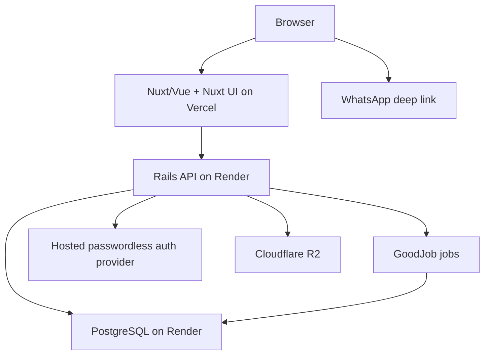

# Berufe — Lean MVP Infrastructure and Architecture

**Status:** implementation baseline  
**Updated:** August 11, 2026  
**Companion:** *Berufe — MVP Feature Plan*

## 1. Purpose and scope

This document defines only the technical decisions needed to build and operate the Berufe MVP for approximately 30–50 professionals in Joinville.

The MVP is a responsive web application where professionals maintain profiles, admins manually review trust evidence, customers search public profiles without an account, and conversations continue through WhatsApp.

The architecture must protect private identity evidence and support reliable releases without introducing infrastructure that the launch does not need.

## 2. Architecture decision

Use two applications and one database:



- **Frontend:** Nuxt using Vue, TypeScript, and Nuxt UI. Nuxt server-renders public profile and Finder pages for fast loading, share previews, and search-engine visibility; Nuxt UI supplies the reusable interface components.
- **Backend:** Ruby on Rails in API-only mode. Rails owns business rules, authorization, data access, provider-session validation, file authorization, moderation actions, and background jobs through Active Job.
- **Database:** one managed PostgreSQL database accessed only by Rails through Active Record.

This is still a modular monolith. The frontend and API are separate deployables, but the backend remains one application—not a collection of services.

Frontend and backend live in one monorepo. Local development and integration tests start the complete application stack through one root `compose.yaml`.

## 3. MVP stack

| Concern | Decision | Purpose |
| --- | --- | --- |
| Frontend | Nuxt + Vue + TypeScript | Public SSR pages and authenticated dashboard in one Vue application. |
| Frontend UI | Nuxt UI (`@nuxt/ui`) | Accessible Vue components and Tailwind-based theming without building a separate design system. |
| Frontend hosting | Vercel | Nuxt deployments, CDN, previews, and environment variables. |
| Backend | Rails API-only | REST JSON API, business logic, authorization, and integrations. |
| Backend hosting | Render web service | Managed Rails runtime close to the database. |
| Worker hosting | Render background worker | Runs GoodJob from the same backend image as Rails. |
| Database | Render PostgreSQL | The single source of truth for accounts and product data. |
| ORM/migrations | Active Record | Rails-native models, constraints, transactions, and migrations. |
| Background jobs | GoodJob | PostgreSQL-backed Active Job processing without Redis or a separate queue service. |
| Local runtime | Docker Compose | Starts Nuxt, Rails, GoodJob worker, and PostgreSQL consistently from the monorepo. |
| Authentication | Hosted passwordless phone-auth provider | Sends and verifies phone codes, owns authentication credentials, and supplies a stable external account identifier. |
| File storage | Cloudflare R2 through a small Rails storage adapter | S3-compatible public/private object storage using feature-owned media records. |
| Source and CI | GitHub + GitHub Actions | Pull requests and automated checks. |
| Code quality | Standard Ruby, Biome, Prettier, Brakeman | Backend/frontend linting, formatting, and backend security scanning. |
| Tests | RSpec, Vitest, and Playwright | Backend rules, frontend behavior, and critical complete flows. |

Use supported stable releases of Ruby, Rails, Node, Nuxt, and PostgreSQL. Pin Ruby/Node versions and dependency lockfiles in the repository.

## 4. Third-party services

### Required now

| Service | Berufe uses it for | Data shared | If unavailable |
| --- | --- | --- | --- |
| Vercel | Nuxt hosting and preview deployments | Web requests and technical logs | The website may be unavailable; API/data remain intact. |
| Render | Rails web/worker hosting and PostgreSQL | API requests, application data, jobs, and technical logs | The API or background work may pause; frontend shows retry/pending states. |
| Hosted auth provider | Professional phone OTP, account identity, and admin MFA | Phone number, authentication challenge, stable provider account ID, and verification status | New logins pause; never bypass verification. Existing Rails authorization still applies. |
| Cloudflare R2 | Portfolio and verification files | Uploaded files and metadata | Upload/view actions pause; database records remain intact. |
| GitHub | Source and CI | Source code and test/build output | Development/deployment pause; production continues. |
| WhatsApp | User-initiated contact and sharing | Prefilled text only after the user taps | Offer copy-number or copy-link fallback. |

### Not required now

- No general backend-as-a-service layer beyond the narrowly scoped hosted authentication provider.
- No WhatsApp messaging API.
- GoodJob is the only queue implementation. It uses the existing PostgreSQL database, so no Redis, Sidekiq, or external queue service is required.
- No CAPTCHA/bot-challenge service or centralized error-tracking provider at launch.
- No external search engine.
- No payment, email, maps/geocoding, CMS, or PDF-generation provider.
- No third-party analytics platform; keep only the small aggregate events needed to evaluate the MVP.

## 5. Responsibilities and request flow

### Public page

1. Nuxt renders the public route on the server.
2. Nuxt requests approved public data from the Rails API.
3. Rails queries indexed PostgreSQL data and returns JSON.
4. Nuxt produces the page and its title/share metadata.

Do not add Redis or a separate cache for 30–50 profiles. Add a short public-page cache only if measured latency requires it. Private dashboard, admin, and tokenized quote responses must never use a shared cache.

### Authenticated change

1. Vue sends a JSON request with the session cookie and CSRF header.
2. Rails authenticates the session.
3. Rails checks the role, record ownership, and current workflow state.
4. Rails validates the request and applies the change in a database transaction.
5. Rails returns a stable JSON response; Vue displays the result.

### API contract

- Prefix endpoints with `/api/v1`.
- Use JSON request and response bodies.
- Return a stable error code, safe message, and field errors when applicable.
- Use pagination and deterministic ordering for lists.
- Keep private/internal fields out of serializers by default.
- Allow CORS only from the known Nuxt local, preview, and production origins.
- Do not create GraphQL or a public developer API for the MVP.

## 6. Backend organization

Use a Rails monolith organized by product capability:

```text
app/
  controllers/api/v1/
  models/
  policies/
  serializers/
  services/
    accounts/
    profiles/
    portfolio/
    verification/
    recommendations/
    network/
    finder/
    quotes/
    moderation/
  validators/
config/
db/
  migrate/
spec/
```

Minimum rules:

- Controllers authenticate, authorize, validate request shape, and delegate; they do not contain the workflow.
- Active Record models hold associations, constraints, and small record-level invariants.
- Multi-step workflows live in named service objects grouped by capability.
- Authorization policies are explicit and tested.
- Serializers define exactly what leaves the API.
- External services are called through small purpose-specific adapters such as `HostedAuthClient` and `R2Storage`; do not build a generic provider framework.
- Use database transactions for state changes that touch multiple records.
- Avoid callbacks for important business workflows; invoke those changes explicitly.
- Configure GoodJob as the Active Job adapter and run it in `external` mode through the dedicated worker. Start with one `default` queue for image processing, OTP-delivery requests, and expired-token/file cleanup. Jobs must be safe to retry; add more queues only after measured contention.

## 7. Frontend organization

```text
app/
  components/
  composables/
  layouts/
  middleware/
  pages/
  services/api/
  types/
  utils/
tests/
  e2e/
```

Minimum rules:

- Pages compose features; reusable visual pieces live in components.
- Use Nuxt UI components first for forms, buttons, navigation, overlays, tables, and feedback states.
- Configure Berufe colors, typography, spacing, and component defaults centrally. Use Tailwind utilities only for page layout and small adjustments.
- Create custom components for Berufe-specific combinations, not wrappers around every Nuxt UI component.
- Do not add another component library, a separate design-system package, or Storybook for the MVP.
- API calls go through one typed API client, not directly from scattered components.
- Nuxt route middleware improves navigation but never replaces Rails authorization.
- Use Nuxt SSR for public Finder/profile pages; authenticated dashboard pages may fetch after hydration.
- Use component-local state or Nuxt `useState` first. Add Pinia only when genuinely shared client state becomes difficult to manage.
- Do not duplicate backend business rules. The frontend may provide instant feedback, but Rails revalidates every change.

## 7.1 Monorepo and local runtime

Use this minimum root layout:

```text
/
  backend/
  frontend/
  compose.yaml
  .env.example
  README.md
```

The Compose stack contains only four services:

| Service | Responsibility |
| --- | --- |
| `frontend` | Nuxt development server with source mounted from `frontend/`. |
| `backend` | Rails API server with source mounted from `backend/`. |
| `worker` | `bundle exec good_job start` process built from the same backend image. |
| `db` | PostgreSQL with a named development volume and health check. |

One command starts the project: `docker compose up --build`. The backend and worker share the same image and environment definition. Use health checks so Rails and the worker wait for PostgreSQL readiness; do not rely only on container start order.

Keep Dockerfiles inside `frontend/` and `backend/`, but keep orchestration at the repository root. Commit `.env.example` with names and safe defaults only; never commit real credentials.

Local development uses a local-disk storage adapter and a fake hosted-auth adapter by default. R2 and live authentication-provider calls are opt-in integration checks, not requirements for starting the stack. Do not add Redis, MinIO, a mail catcher, or other support containers until an implemented feature needs them.

Docker Compose standardizes local development and CI integration runs; it is not the MVP production orchestrator. Production keeps the Nuxt and Rails deployments separate on Vercel and Render.

## 8. Authentication and authorization

### Professional login

Before implementation, select a hosted provider that supports Brazilian SMS OTP, a stable external account identifier, server-verifiable sessions, admin MFA, a verification-only phone challenge for accountless clients, test/sandbox behavior, and appropriate privacy/data-processing terms. The application depends on that capability contract rather than provider-specific business logic.

1. The user enters a Brazilian phone number.
2. Rails normalizes the number to E.164 and checks the OTP cooldown and daily allowance.
3. Rails enqueues a retry-safe delivery request through the hosted-auth adapter; the provider sends the SMS code and owns the OTP value.
4. The user submits the code; Rails asks the provider to verify it and validates the returned provider identity.
5. If approved, Rails creates or finds the Berufe account by the stable `auth_provider_id`, synchronizes the verified E.164 phone, and returns the provider-backed session in a secure, HTTP-only cookie.

The provider owns authentication credentials, OTP values, and session expiry. Berufe stores the stable provider account identifier and verified phone on `user_account`, but does not store passwords or OTPs. Rails validates the provider session on authenticated requests and still checks the Berufe account role/status and record ownership. Logout clears the browser session and revokes it through the provider when supported; suspending an account blocks it immediately even if a provider session remains technically valid.

To control SMS abuse without Rack::Attack or Turnstile, Rails enforces a short resend cooldown and conservative daily limits by phone and IP, stored as short-lived digests/counters in PostgreSQL. Provider limits remain a second layer. Return the same generic response whether or not an account exists, and purge expired counters with GoodJob.

Use `www.berufe...` and `api.berufe...` under the same parent domain. Requests include credentials, CORS uses an exact origin allowlist, and state-changing requests require a CSRF token plus origin validation. Never store auth tokens in `localStorage`.

### Admin access

- Use a dedicated admin account.
- Require TOTP or another provider-supported second factor through the hosted authentication provider.
- Check the admin role in Rails policies.
- Log every verification, moderation, suspension, and restoration decision.

### Customers and public tokens

Customers do not create accounts. Client-recommendation phone confirmation uses a verification-only provider challenge and never creates a `user_account` or reusable customer session. Recommendation, invitation, and quote-share flows use high-entropy, single-purpose tokens and store only their cryptographic hashes. Recommendation and invitation tokens expire and are one-time; quote tokens remain valid while the quote is `shared` because the Feature Plan defines only `draft` and `shared` quote states.

### Authorization baseline

- Anonymous users receive approved public data only.
- Professionals edit only records owned by their account.
- Admin endpoints require the admin role.
- Verification documents require short-lived, server-authorized access.
- UI visibility is never treated as authorization.

## 9. PostgreSQL and data rules

PostgreSQL is the single application database. Rails/Active Record is the only application layer allowed to access it.

- Use UUID primary keys and UTC `timestamptz` values.
- Store phone numbers in E.164 format.
- Store money as `numeric(12,2)` and use Ruby `BigDecimal` for calculations.
- Use foreign keys, unique indexes, check constraints, and explicit status values for important rules.
- Apply schema changes only through reviewed Rails migrations.
- Use transactions for moderation, publication, relationship confirmation, recommendation completion, and quote finalization.
- Use PostgreSQL filtering and indexes for Finder. Do not add a search service or numeric trust score.
- Keep production database credentials server-only; Nuxt never connects to PostgreSQL.
- Record the accepted terms and privacy-notice version with each acceptance timestamp; a timestamp alone is not sufficient audit evidence.
- Enforce exactly one primary service per professional. The primary service is the singular main service shown on the public profile.
- Represent “All Joinville” without duplicate nullable-area rows, using a partial unique index or a PostgreSQL `NULLS NOT DISTINCT` constraint.
- Preserve the last approved profile snapshot while material edits are pending. Public serializers continue to read the approved snapshot until an admin approves the pending revision.
- Treat professional acceptance as necessary but not sufficient for a public professional relationship. An accepted relationship enters the shared moderation queue; public serializers require both recipient acceptance and an admin approval action, and hiding removes it immediately.
- Keep product analytics privacy-friendly but source-aware enough to calculate the approved success signals. An anonymous search event may record whether at least one result profile was opened, while professional daily metrics distinguish WhatsApp handoffs originating on profiles from those originating on result cards. Do not create visitor identities to do so.

### Data visibility

| Visibility | Examples | Rule |
| --- | --- | --- |
| Public | Published profile, approved portfolio, services, approved trust labels | Returned by public serializers only after approval. |
| Private | Phone, moderation notes, draft quote customer details | Owner/admin access only as required. |
| Token-authorized | Shared quote and its customer-facing details | Returned only to a bearer of the valid high-entropy quote URL; never indexed or placed in a shared cache. |
| Restricted | Verification documents, secrets, stored session material, share-token hashes | Server-only access and never logged. Raw share tokens may leave the server only inside the user-requested HTTPS share URL and must never be persisted or logged. |

Collect only data required by the MVP. Define retention/deletion rules for private and restricted fields before launch. Support correction, suspension, and deletion requests. Obtain qualified Brazilian privacy/legal review before accepting real users.

## 10. File storage

Use Cloudflare R2's S3-compatible API through a small Rails-owned storage adapter. Approved feature records retain the public URL/key fields described by the Feature Plan. A narrowly scoped pending-upload record may hold the temporary private key, ownership, purpose, state, and deletion time needed before a profile or portfolio image is approved; verification files continue to use `verification_file`.

| Bucket | Access | Contents |
| --- | --- | --- |
| `berufe-public-media` | Public read | Approved profile and optimized portfolio images. |
| `berufe-private-media` | Private | Pending uploads and verification evidence. |

Flow:

1. Vue requests an upload authorization from Rails.
2. Rails checks the session, ownership, purpose, type, and size, then returns a short-lived presigned upload URL.
3. The browser uploads directly to R2.
4. Rails records the private storage key on the owning feature record, validates the uploaded object, and keeps it private while pending review.
5. Approval creates the optimized public object and records its public URL/key on the approved profile or portfolio projection; rejected files are deleted according to the retention rule.

Accept only the image/document types required by the feature plan. Re-encode public images and remove unnecessary metadata. Never expose R2 credentials or permanent URLs for verification evidence.

## 11. WhatsApp decision

Berufe does not send WhatsApp messages in the MVP.

- Customer contact opens `https://wa.me/<number>?text=<encoded-message>`.
- Profile sharing uses the Web Share API with copy-link fallback.
- Recommendation requests, professional invitations, and quote sharing open an explicit user-initiated WhatsApp deep link with the appropriate public token URL; provide copy-link fallback when WhatsApp cannot open.
- Berufe may record the handoff click, but never sees message content or delivery status.

Meta Cloud API, Zenvia, Zernio, and Twilio WhatsApp are therefore unnecessary today. If a specific automated reminder later proves valuable and users consent, evaluate Meta Cloud API first and Zenvia when managed Brazilian support is worth the additional provider.

Never use unofficial WhatsApp Web automation or shared personal accounts.

## 12. Minimum security baseline

- HTTPS and secure, HTTP-only session cookies.
- Server-side validation and authorization for every mutation.
- Hosted-auth-provider limits plus Rails-enforced OTP cooldowns and daily allowances.
- High-entropy, single-purpose tokens and database uniqueness constraints for anonymous recommendation, invitation, and quote actions. Recommendation and invitation tokens expire and are one-time; quote tokens are long-lived while the quote remains shared.
- Exact CORS origins, CSRF protection, and origin checks for authenticated mutations.
- Separate production and non-production credentials in platform secret stores.
- No phone numbers, OTPs, raw tokens, session cookies, verification files, signed URLs, or request bodies in application/platform logs.
- Security headers on Nuxt and Rails, including content type, framing, and referrer controls.
- Parameterized Active Record queries and allowlisted redirect destinations.
- Immediate credential rotation after suspected exposure.

These are MVP requirements because Berufe handles phone numbers and identity evidence.

## 13. Development standards

### Rails

- Use the `standard` gem as the Ruby linter and formatter. Run `bundle exec standardrb` in CI and `bundle exec standardrb --fix` locally when formatting is needed.
- Do not add a separate RuboCop configuration; Standard owns the Ruby style rules.
- Keep Brakeman as a separate static security scanner. It is not a formatter or replacement for Standard.
- Prettier does not format Ruby. It may format repository Markdown, JSON, and compatible YAML, but Ruby files remain exclusively owned by Standard.
- RSpec for models, services, policies, requests, and integration behavior.
- Use English for code/database names and Brazilian Portuguese for user-facing copy.
- Represent workflows with explicit states such as `draft`, `pending_review`, `approved`, and `rejected`.
- Recalculate quote totals in Rails before saving or sharing.
- Keep verification labels controlled by Berufe, never free-form claims.
- Hiding or suspending a profile must remove it from public API responses immediately.

### Nuxt/Vue

- TypeScript strict mode and Biome for JavaScript, TypeScript, Vue, and CSS code-quality rules. Pin Biome initially and review upgrades because Vue support is newer than its JavaScript/TypeScript support.
- Prettier is the frontend formatter for Vue, TypeScript, JavaScript, CSS, JSON, Markdown, and supported configuration files.
- Disable Biome's formatter so Prettier is the only frontend formatting authority. Do not install ESLint.
- Provide scripts for `lint`, `lint:fix`, `format`, and `format:check`; CI runs the non-writing `lint` and `format:check` scripts.
- Use Nuxt UI as the default UI toolkit. Prefer its built-in accessibility and interaction behavior before writing custom controls.
- Keep client-side form validation focused on immediate feedback; Rails remains the authority and its field errors must map back to the relevant Nuxt UI form controls.
- Use schema validation for API responses where trust boundaries require it.
- Use Vue Composition API and `<script setup>` consistently.
- Build mobile-first with semantic HTML, keyboard access, visible labels/errors, and no color-only status meaning.
- Keep server/client-only code explicit so private configuration never enters the browser bundle.

### Shared

- Keep changes small and purpose-specific.
- Add an abstraction only after a real second use.
- Never log sensitive payloads.
- Treat API contract changes and database migrations as part of the same feature delivery.

## 14. Tests and delivery

### Required tests

RSpec covers:

- hosted-auth sessions, authorization policies, and public/private serializers;
- publication, moderation, and verification transitions;
- quote calculations;
- recommendation/invitation token expiry and one-time use, plus secure quote-token access;
- Finder filters/order and database constraints;
- hosted-auth/R2 adapters with fakes, never real provider calls.

Vitest covers important Vue components, composables, and API error behavior.

Keep Playwright to five release-critical flows:

1. professional OTP login and profile submission;
2. admin profile/evidence approval;
3. public search, profile view, and WhatsApp handoff;
4. recommendation or professional-relationship confirmation plus moderation;
5. quote creation and secure share link.

Tests use synthetic data and never send real SMS or WhatsApp messages.

### Repository and CI

Use one repository with `frontend/` and `backend/` directories. This keeps API and UI changes coordinated without merging their runtimes.

- Pull requests merge into `main` after CI.
- CI builds both Dockerfiles and runs the integration stack from the root Compose definition when a change crosses the API boundary.
- Frontend CI runs `biome lint`, `prettier --check`, `nuxt typecheck`, Vitest, and the Nuxt production build.
- Backend CI runs `bundle exec standardrb`, Brakeman, RSpec, and a Rails boot/migration check.
- A small repository formatting check may run Prettier over Markdown, JSON, and compatible YAML; it must exclude Ruby, generated files, lockfiles, and Rails YAML/ERB files that Prettier cannot safely parse.
- Playwright runs for release-critical changes and before production release.
- Vercel creates frontend previews; preview Rails/PostgreSQL use a shared non-production environment with synthetic data.
- Production deploys only after checks pass; run Rails migrations as an explicit release step before dependent code.

Use local, preview/staging, and production environments only. Local runs through Docker Compose. Local and non-production environments must never use production PostgreSQL, R2 private files, live authentication-provider delivery, or copied real-user data.

## 15. Operations needed at launch

- Render monitors Rails health, PostgreSQL connections, GoodJob processing, and database status; Vercel monitors frontend deployment health.
- Use structured Rails/Nuxt platform logs with request IDs to investigate errors. Monitor login failures, failed jobs/uploads, and the age of the manual moderation queue. A centralized error tracker is intentionally deferred.
- Use a paid Render PostgreSQL plan with managed backups; verify its configured retention and complete one restore test before launch.
- Keep Rails migrations and catalog seed data in Git.
- Assign an owner for deployments, database access, authentication-provider spend, R2 private access, moderation, and privacy requests.

For MVP storage loss, public media can be uploaded again and private evidence can be requested again. Do not build a custom cross-provider backup system yet.

If production breaks: disable the affected flow or credential, assess scope, recover or forward-fix, verify the five critical flows, and document the correction. Privacy/security incidents require qualified legal/privacy support.

## 16. Implementation order

1. **Foundation:** monorepo, Dockerfiles and root Compose stack, Nuxt with Nuxt UI, Rails API-only, PostgreSQL, GoodJob, Vercel/Render environments, CI, and security headers.
2. **Access:** hosted passwordless phone authentication, provider-backed sessions, OTP cooldown/allowance controls, roles/policies, CSRF/CORS, and admin MFA.
3. **Profiles and evidence:** catalog, approved snapshots and pending revisions, direct R2 uploads, background image processing, profile/portfolio/verification moderation, public serializers, and Nuxt public pages.
4. **Discovery and trust graph:** Finder and WhatsApp handoff, followed by client recommendations and moderated professional relationships.
5. **Quotes and launch:** secure quote links, critical end-to-end tests, database restore test, and launch gate.

## 17. Explicitly deferred

Do not build these for the MVP:

- microservices, Kubernetes, Redis, Sidekiq, external message brokers, or event streaming;
- GraphQL or a separately versioned public API;
- Algolia/Typesense/Elasticsearch or a graph database;
- automated WhatsApp notifications or chatbots;
- realtime updates, native apps, payments, booking, or internal chat;
- multi-city, multi-region, or enterprise infrastructure;
- generic provider abstractions or infrastructure-as-code for every service.

Reconsider only when measured evidence requires it:

| Enhancement | Evidence required |
| --- | --- |
| Automated WhatsApp through Meta/Zenvia | A specific reminder improves completion and users consent. |
| Separate queue infrastructure | GoodJob creates measured database contention or cannot meet job throughput/retry needs. |
| Rack::Attack or a bot-challenge service | OTP or anonymous-form abuse exceeds the PostgreSQL/provider controls and creates material cost or moderation load. |
| Centralized error tracking | Platform logs and request IDs repeatedly fail to diagnose production errors quickly enough. |
| Dedicated search | Indexed PostgreSQL queries fail the real latency target. |
| Analytics provider | First-party aggregates cannot answer a defined decision. |
| Storage backup/export system | Re-upload/re-request recovery becomes unacceptable. |
| Separate backend services | Independent scale, runtime, security, or team ownership requires them. |

## 18. Launch gate

Accept real users only when:

- public API serializers expose approved fields only;
- ownership/admin policy tests pass;
- private R2 verification objects cannot be read publicly;
- OTP abuse controls, provider-session invalidation/logout, account suspension, CSRF/CORS, and admin MFA work;
- platform logs redact personal and restricted data;
- failed GoodJob jobs are visible and retryable;
- public Nuxt profile metadata and WhatsApp/copy fallback work on mobile;
- PostgreSQL backup retention is verified and a restore test has succeeded;
- privacy notice, terms, retention rules, and operational owners are ready;
- the five critical Playwright flows pass against the release candidate.

## Final definition

Berufe is developed in one monorepo whose Nuxt frontend, Rails API, GoodJob worker, and PostgreSQL database run locally through Docker Compose. Production deploys Nuxt/Nuxt UI to Vercel and Rails to Render with managed PostgreSQL. Rails owns business rules, authorization, product data, moderation, and background jobs; a hosted passwordless provider owns authentication credentials, OTPs, stable external identities, sessions, and admin MFA. Cloudflare R2 stores files through a small Rails adapter, and WhatsApp remains a user-initiated deep link. OTP abuse controls live in Rails/PostgreSQL in addition to provider controls; centralized bot protection and error tracking are deferred until evidence justifies them.

## Implementation references

- [Rails API-only applications](https://guides.rubyonrails.org/api_app.html)
- [Nuxt rendering modes](https://nuxt.com/docs/4.x/guide/concepts/rendering)
- [Nuxt UI](https://ui.nuxt.com/docs/getting-started)
- Hosted authentication provider documentation, selected before implementation against the requirements in §8
- [Cloudflare R2 S3 compatibility](https://developers.cloudflare.com/r2/get-started/s3/)
- [Render PostgreSQL backups](https://render.com/docs/postgresql-backups)
- [GoodJob](https://github.com/bensheldon/good_job)
- [Standard Ruby](https://github.com/standardrb/standard)
- [Biome language support](https://biomejs.dev/internals/language-support/)
- [Prettier](https://prettier.io/docs/install)
