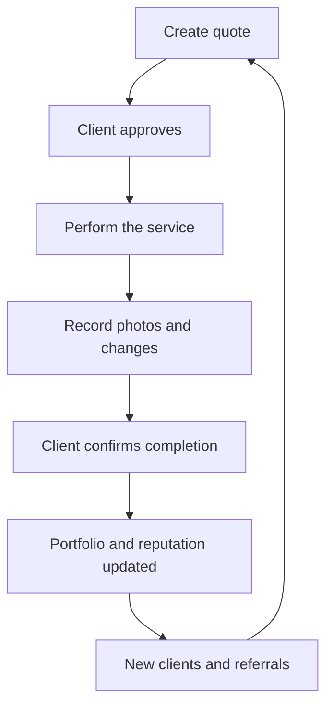

No. If Berufe is only a portfolio and a search directory, the professional creates a profile once, sends the link to a few people, and hardly ever comes back.

The portfolio should be the automatic result of using Berufe, not the main product.

The stronger thesis would be:

> The professional joins Berufe to manage their services. As a consequence, they build reputation, a portfolio, and a professional network.

## How Doximity actually creates recurrence

It is important to separate two audiences:

- Physicians are members of the network and use it for free.
- Hospitals, recruiters, and health care companies are the main paying customers.

Doximity does not "lock in" physicians through the profile. It built four layers:

| Layer        | Function                                                                           |
| ------------ | ---------------------------------------------------------------------------------- |
| Identity     | A pre-filled, verified professional résumé                                         |
| Utility      | Fax, secure communication, news, and productivity tools                            |
| Network      | Colleagues, specialists, referrals, and opportunities                              |
| Accumulation | Connections, history, reputation, and personalization grow more valuable over time |

In 2021, the company itself described its strategy this way: profiles were pre-filled with public and commercial data, and physicians only verified and completed the information. Once verified, they gained access to the network and the tools. [Doximity's S-1 filing with the SEC](https://www.sec.gov/Archives/edgar/data/1516513/000162828021011269/doximity-sx1.htm)

The main growth driver the founder pointed to in the early years was not the profile: it was secure communication. The company also realized that critical mass emerged in small markets — a hospital, a city, or a specialty — and not across the entire country at once. [Jeff Tangney's interview with TechCrunch](https://techcrunch.com/2014/03/15/with-40-of-u-s-doctors-signed-on-doximitys-jeff-tangney-reveals-how-the-social-network-for-m-d-s-hit-the-tipping-point/)

In a little over three years, Doximity announced it had reached more than 50% of American physicians. By then it already offered digital fax, news, a referral directory, careers, and login for other applications. [Timeline published by Doximity](https://press.doximity.com/articles/announcing-the-largest-physician-network-in-the-us)

## The equivalent for Berufe

Berufe needs to find its own "indispensable tool." My recommendation is to start with the professional quote and turn it into the beginning of the entire service journey.

The core product could be:

> Berufe Work: quote, execution, proof of work, and reputation in one place.

The professional would not log in to "check whether any lead showed up." They would log in because they need to:

- Put together a quote.
- Check whether the client approved it.
- Look up the address and date of the service.
- Record changes to what was agreed.
- Organize photos.
- Collect a payment.
- Prove the work was completed.
- Ask for a review.
- Find a partner.
- Look up previous clients and services.

## The recurring core of the MVP

### 1. Quotes over WhatsApp

The professional fills in:

- Client
- Service
- Materials
- Labor
- Timeline
- Terms
- Payment method
- Photos or notes

Berufe generates a link and a professional PDF to send over WhatsApp.

The client does not need to create an account. They open it and can:

- Approve
- Request a change
- Decline
- Call the professional
- Accept the terms

This feature has value even if Berufe does not yet have a single consumer searching on the site.

### 2. Service page

When the quote is approved, it automatically becomes a service:

- Scheduled date
- Status
- Approved scope
- Before-and-after photos
- Requested changes
- Amounts received and outstanding
- Other professionals involved
- Completion confirmation

This creates a history that protects both client and professional against misunderstandings.

### 3. Automatic portfolio

Upon finishing, the professional chooses which photos may be published.

Berufe updates:

- Number of confirmed services
- Categories actually performed
- Neighborhoods served
- Authorized photos
- Reviews tied to real jobs
- Professionals who took part
- Average value or duration, for internal metrics only

That way, the professional does not have to maintain the portfolio by hand.

### 4. Evidence-based reputation

Instead of relying on stars alone:

- Identity confirmed
- Phone confirmed
- CNPJ or MEI verified
- Certificate checked
- Quote approved by the client
- Service confirmed
- Repeat client
- Recommendation from another professional
- Work done together

Example profile:

> João completed 18 confirmed services, received 14 client recommendations, and has already worked with 6 verified professionals.

That is far harder to fake.

### 5. Partner network

During a job, the painter can add the electrician or drywall installer who worked with them.

The partner receives:

> "João reported that they worked with you on this renovation. Confirm your participation and create your professional profile."

This is one of the main growth levers.

## Recurrence without requiring daily access

Not every painter or electrician needs to open Berufe every day. The right frequency should follow the real rhythm of the work.

| Moment             | Reason to log in                                 |
| ------------------ | ------------------------------------------------ |
| New client         | Create a quote                                   |
| After sending it   | Check for approval                               |
| Before the job     | Look up the schedule and scope                   |
| During the service | Record photos, costs, or changes                 |
| At completion      | Request sign-off and a review                    |
| Weekly             | Review outstanding amounts and upcoming services |
| Monthly            | Analyze revenue, clients, and performance        |
| Whenever needed    | Find or refer a partner                          |

WhatsApp would work as the front door:

- "Your quote was viewed."
- "The client approved it."
- "A payment is due tomorrow."
- "Confirm the completion of the service."
- "The client left a review."

Tapping the message takes the professional straight to the screen they need, with no navigation through the system.

## What creates a healthy dependency

It is not about making it hard to leave or hiding the data. It is about making the product accumulate value:

- Saved quote templates.
- A personal table of services and prices.
- A client directory.
- Negotiation history.
- Photos organized by job.
- Verified reviews.
- A service schedule.
- Receivables.
- A partner network.
- Business indicators.

After six months, Berufe knows that professional's services, clients, prices, partners, and reputation. As a result, the next quote gets faster and more reliable.

The data must remain exportable. Retention has to come from usefulness, not from technical lock-in.

## How Doximity solved the "zero professionals" problem

The strategy had some very smart elements.

### 1. It did not present an empty network

Doximity gathered information from hundreds of databases and publications to form an initial directory. The physician would then verify their identity and update the profile. The company still describes the use of public and commercial data for pre-filling. [Stanford Graduate School of Business](https://www.gsb.stanford.edu/faculty-research/case-studies/doximity-financing-social-network-physicians), [SEC](https://www.sec.gov/Archives/edgar/data/1516513/000162828021011269/doximity-sx1.htm)

Berufe can adapt this more cautiously:

- Create draft company profiles from CNPJ and permitted commercial data.
- Invite the professional to claim and verify them.
- Never publish a personal phone number, home address, or sensitive information without authorization.
- Offer assisted setup over WhatsApp.

### 2. It delivered individual value

Digital fax was useful even if the physician did not yet have many colleagues on the network.

At Berufe, quotes need to be useful even if no client is searching on the site yet.

That is the answer to the two-sided problem:

> The professional brings their own clients to the tool, instead of waiting for Berufe to deliver clients.

### 3. It grew through small communities

Doximity observed that the tipping point happened in specific hospitals, cities, and specialties. Smaller markets could reach density faster.

At Berufe, I would start with:

- Joinville
- Home renovation and maintenance
- Five connected categories
- Thirty founding professionals
- At least three verified professional relationships per member

Thirty connected professionals are worth more than a hundred isolated sign-ups.

### 4. It built distribution through partnerships

Doximity partnered with hospitals, medical schools, apps, and with U.S. News, which began using its profiles in its physician finder.

The local equivalent would be:

- Building-material stores
- Condominium management companies
- Real estate agencies
- Architects
- Construction companies
- Facilities companies
- Technical schools
- Paint, flooring, and tool manufacturers

## Berufe's four growth engines

### Engine 1 — Quotes

1. The professional creates a quote.
2. Sends it to the client.
3. The client visits Berufe.
4. Approves the work.
5. Confirms the service.
6. Leaves a review.
7. The profile gains reputation.

Every quote brings a new client into the ecosystem with no ad spend.

### Engine 2 — Collaboration

1. The professional needs a partner.
2. Invites someone to the job.
3. The partner claims their profile.
4. Both confirm they worked together.
5. The professional network gets denser.

### Engine 3 — Sharing

1. A service is completed.
2. Berufe assembles a "before and after" card.
3. The professional shares it on Instagram or WhatsApp.
4. Interested people visit the profile.
5. New contacts come in.

### Engine 4 — Companies

1. A condominium or real estate agency looks for a service provider.
2. Invites its current professionals to Berufe.
3. The professionals keep documents and records up to date.
4. Other companies start finding them.
5. The network becomes the local pool of verified providers.

## What to learn from other solutions

Houzz started from a real renovation problem and built a community between homeowners and professionals. Today, Houzz Pro offers CRM, quotes, scheduling, invoicing, and payments — showing the evolution from "inspiration and portfolio" to professional operations. [Houzz's story](https://www.houzz.com/aboutUs), [Houzz Pro workflow](https://pro.houzz.com/pro-learn/blog/perfect-your-construction-workflow-with-houzz-pro)

ServiceTitan went even further: it became an operating system for service companies, covering proposals, scheduling, dispatch, invoicing, and follow-up. Its founders started from the operational problems their own families' service companies lived through. [ServiceTitan](https://www.servicetitan.com/), [the founders' story](https://www.servicetitan.com/guides/contractor-playbook/leadership)

Berufe can occupy a space between the two:

> Doximity's professional network + Houzz's visual reputation + a lightweight version of ServiceTitan's operations.

We should not try to build all of ServiceTitan at the start. The entry point would be just the flow that drives the most growth: quote, approval, completion, and reputation.

## Recommended MVP

### Initial version

- Sign-up and phone verification
- Professional profile
- Services and service area
- Quote generator
- Approval link for the client
- Service page
- Before-and-after photos
- Completion confirmation
- Verified review
- Partner invitation
- Admin panel

### Second version

- Templates and price table
- Schedule
- Client directory
- Payment reminders
- Add-on proposals
- Scope changes
- Receipt
- Basic indicators
- Referral request

### After validation

- Pix payments
- Berufe Pro subscription
- Team management
- Job postings and hiring
- Provider accreditation
- Sponsored technical content
- Plans for condominiums, real estate agencies, and construction companies

The most important decision, therefore, is this:

> Berufe's MVP should not start with professional search. It should start with the tool the professional uses with the clients they already have.

Public search will be fed naturally by the services performed. That way, Berufe can grow even starting with zero consumers, and every use of the system simultaneously strengthens the professional's operation, their reputation, and the network.
